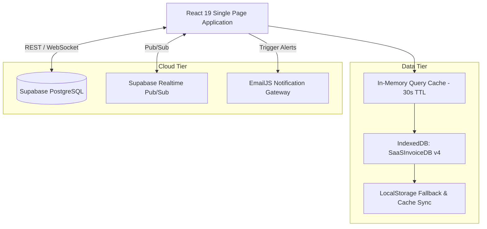
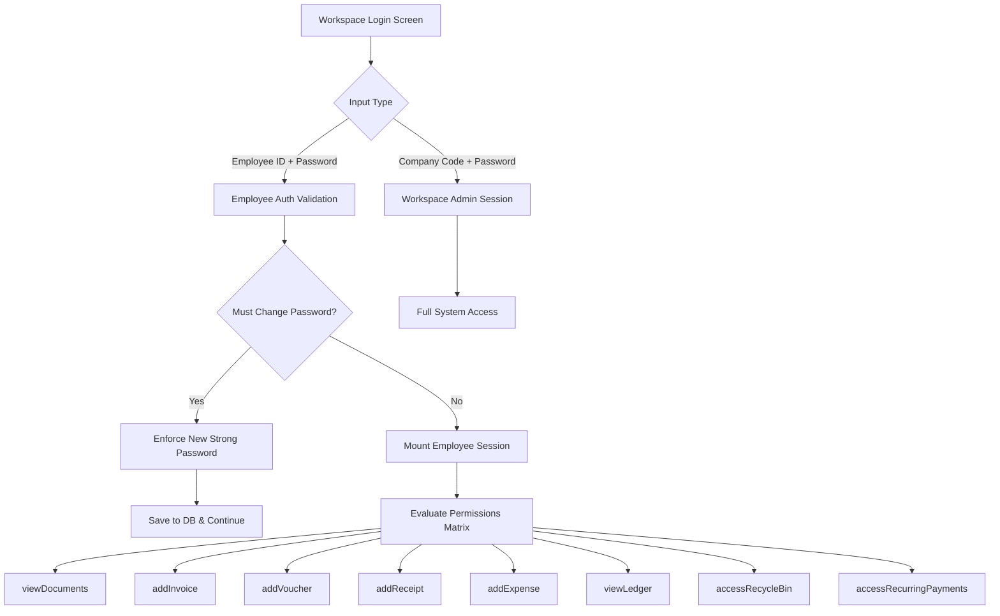
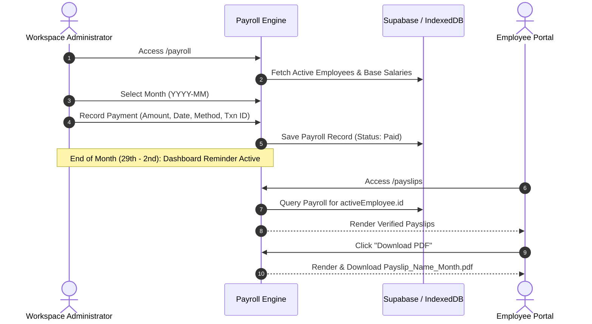
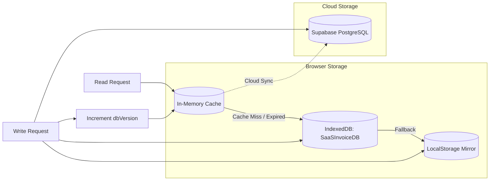
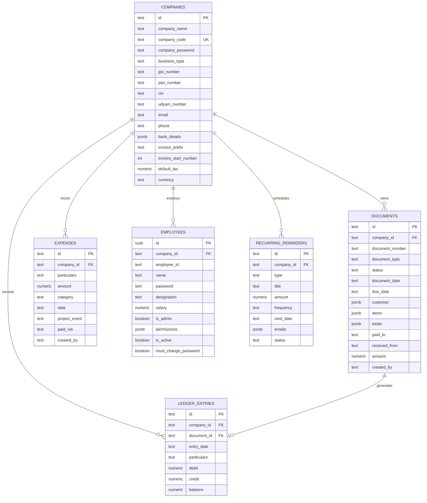
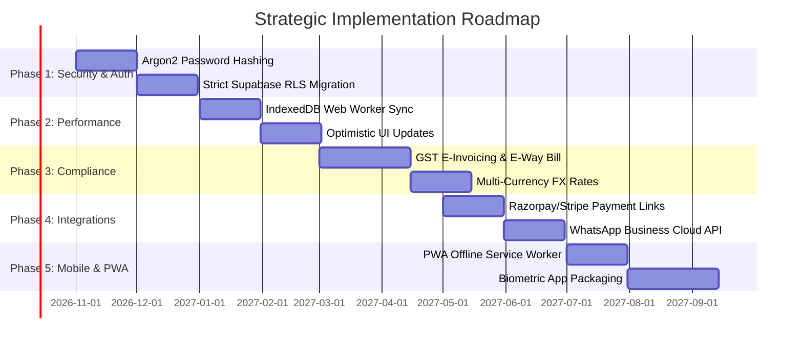

# DocuCraft / UNAI Billing Enterprise Suite
## Comprehensive Features Specification & Strategic Implementation Plan

> **Document Version:** 2.0.0  
> **Target Audience:** Engineering Leads, Product Managers, DevOps, System Architects  
> **Status:** Active & Reference Architecture  
> **Application Repository:** `/home/admin-system/Documents/billing`

---

## Table of Contents
1. [Executive Summary & Core Architecture](#1-executive-summary--core-architecture)
2. [Complete Features Matrix & Module Deep Dive](#2-complete-features-matrix--module-deep-dive)
   - [2.1 Multi-Tenant Workspace & Onboarding Engine](#21-multi-tenant-workspace--onboarding-engine)
   - [2.2 Authentication & Granular Role-Based Access Control (RBAC)](#22-authentication--granular-role-based-access-control-rbac)
   - [2.3 Dynamic Document Engine (Invoices, Vouchers & Receipts)](#23-dynamic-document-engine-invoices-vouchers--receipts)
   - [2.4 Presentation Templates & High-Resolution Client-Side PDF Engine](#24-presentation-templates--high-resolution-client-side-pdf-engine)
   - [2.5 Corporate Expenses & Monthly Budgeting System](#25-corporate-expenses--monthly-budgeting-system)
   - [2.6 Customer & Vendor General Ledger (Double-Entry Bookkeeping)](#26-customer--vendor-general-ledger-double-entry-bookkeeping)
   - [2.7 Corporate Payroll & Employee Payslip Portal](#27-corporate-payroll--employee-payslip-portal)
   - [2.8 Recurring Reminders & Automated Email Dispatch](#28-recurring-reminders--automated-email-dispatch)
   - [2.9 30-Day Recycle Bin & Soft Deletion Lifecycle](#29-30-day-recycle-bin--soft-deletion-lifecycle)
   - [2.10 Public Client Preview & Omnichannel Sharing](#210-public-client-preview--omnichannel-sharing)
   - [2.11 Executive Analytics & Real-Time Dashboard](#211-executive-analytics--real-time-dashboard)
3. [System Architecture & Data Persistence Layer](#3-system-architecture--data-persistence-layer)
   - [3.1 Triple-Tier Storage Model](#31-triple-tier-storage-model)
   - [3.2 Database Schema & Entity Relationships](#32-database-schema--entity-relationships)
   - [3.3 In-Memory Query Caching & Egress Optimization](#33-in-memory-query-caching--egress-optimization)
4. [Current Implementation Audit](#4-current-implementation-audit)
5. [End-to-End Strategic Implementation Roadmap](#5-end-to-end-strategic-implementation-roadmap)
   - [Phase 1: Security Hardening & Session Integrity](#phase-1-security-hardening--session-integrity)
   - [Phase 2: Performance, Cache & Sync Optimization](#phase-2-performance-cache--sync-optimization)
   - [Phase 3: Advanced Accounting & Compliance](#phase-3-advanced-accounting--compliance)
   - [Phase 4: Integrations & Omnichannel Notifications](#phase-4-integrations--omnichannel-notifications)
   - [Phase 5: Offline-First PWA & Enterprise Scale](#phase-5-offline-first-pwa--enterprise-scale)
6. [Operational & Deployment Guide](#6-operational--deployment-guide)

---

## 1. Executive Summary & Core Architecture

**DocuCraft / UNAI Billing Suite** is a commercial-grade, multi-tenant financial operations platform designed for small-to-medium enterprises (SMEs), startups, and corporate teams. It unifies invoicing, expense tracking, double-entry party ledgers, employee management, and monthly payroll into a high-performance web application.



### Key Architectural Tenets
1. **Local-First Reliability**: Instant UI responses and full offline capabilities via browser **IndexedDB** (`SaaSInvoiceDB`) with synchronous **LocalStorage** fallbacks.
2. **Cloud Synchronization**: Real-time multi-device replication and data backups backed by **Supabase PostgreSQL** with Row-Level Security (RLS) policies.
3. **Zero-Server PDF Rendering**: Pixel-perfect vector and canvas A4 PDF rendering executed entirely in the client's browser using `html2canvas-pro` and `jsPDF`, removing server PDF compute bottlenecks.
4. **Strict Isolation & RBAC**: Dedicated employee logins, custom permissions, and multi-company workspace isolation.

---

## 2. Complete Features Matrix & Module Deep Dive

### 2.1 Multi-Tenant Workspace & Onboarding Engine

The platform supports multiple isolated business profiles within a single browser session or across team devices.

* **Unique Workspace Identification**: Every company is provisioned a unique `company_code` (e.g., `CMP-9482`) and a master `company_password`.
* **4-Step Onboarding Wizard** (`src/pages/Onboarding.tsx`):
  1. *Company Identity*: Legal entity name, business structure (Private Limited, LLP, Sole Proprietorship, Partnership), logo upload, and brand theme color.
  2. *Banking & Tax Setup*: Bank account number, IFSC code, account type (Savings/Current), daily transfer limit, GSTIN, PAN, CIN, and Udyam Registration number.
  3. *Document Defaults & Counters*: Default tax rate (e.g., 18%), currency symbol (INR ₹, USD $, EUR €, GBP £), sequential counter prefixes (`INV-`, `VCH-`, `REC-`), and starting numbers (default: `1001`).
  4. *Security & Access*: Generation of workspace access credentials and code.
* **Join Workspace Flow**: Existing employees or co-owners can mount an existing company profile by inputting the Company Code and Password.
* **Profile Management & Document Retargeting** (`src/pages/CompanyEdit.tsx`):
  - Edit legal, tax, and banking details at any time.
  - Option to retrospectively update terms & conditions across all existing documents in one batch transaction (`updateCompanyDocumentsTerms`).

---

### 2.2 Authentication & Granular Role-Based Access Control (RBAC)

The application provides dual-mode authentication supporting both administrative owners and restricted employees.



* **Dual-Authentication Modes** (`src/pages/WorkspaceLogin.tsx`):
  1. **Workspace Admin / Owner**: Direct authentication using the Company Master Password. Grants unrestricted access to settings, employee management, payroll, and financials.
  2. **Employee Login**: Employees login with `Company Code` + `Employee ID` (`loginId`) + `Password`.
* **First-Time Login Security**:
  - Admins can provision temporary passwords.
  - On first sign-in, if `mustChangePassword` is `true`, the user is intercepted with a mandatory password reset modal enforcing standard password complexity rules.
* **Granular Permissions Matrix** (`EmployeePermissions`):
  | Permission Key | Description | Default Employee |
  | :--- | :--- | :---: |
  | `viewDocuments` | Read-only access to invoice and voucher list | Enabled |
  | `addInvoice` | Ability to author, edit, and issue invoices | Enabled |
  | `addVoucher` | Ability to author and issue payment vouchers | Enabled |
  | `addReceipt` | Ability to author and issue receipts | Enabled |
  | `addExpense` | Ability to log operational expenses | Enabled |
  | `viewLedger` | Access to the double-entry general ledger | Enabled |
  | `accessRecycleBin` | View and restore soft-deleted items | Disabled |
  | `accessRecurringPayments` | Configure recurring income/outcome schedules | Disabled |
* **Employee Directory Administration** (`src/pages/Employees.tsx`):
  - Add, edit, deactivate, or delete employees.
  - Auto-generate cryptographically secure strong passwords (`generateStrongPassword`).
  - One-click copy credentials and shareable onboarding templates via WhatsApp/Email.
  - Track employee activity: document count, expense count, and total transactional volume.
* **Self-Profile Modal** (`src/components/layout/MainLayout.tsx`):
  - Quick-view header avatar/initials button.
  - 4 tabs: Personal Information, My Invoices, My Documents, and My Logged Expenses.

---

### 2.3 Dynamic Document Engine (Invoices, Vouchers & Receipts)

A unified document creation and management engine (`src/pages/CreateDocument.tsx` and `src/pages/Documents.tsx`).

#### Document Types
1. **Tax Invoices**:
   - Customer details: Name, company, GSTIN, email, phone, billing & shipping address, place of supply.
   - Dynamic item table: Item description, HSN/SAC code, quantity, unit rate, individual tax rate.
   - Dual tax engine: Intra-state (CGST + SGST split 50/50), Inter-state (IGST 100%), Single Tax, or Exempt/None.
   - Global discounts: Percentage-based or fixed value, pro-rated across items.
   - Mathematical round-off to nearest integer rupee with automatic fractional adjustment.
2. **Payment & Debit Vouchers**:
   - Beneficiary (`paidTo`), transaction amount, payment mode (Cash, Bank Transfer, Card, UPI).
   - Voucher category classification and transaction description.
3. **Payment Confirmation Receipts**:
   - Payer (`receivedFrom`), amount, payment instrument, reference ID, and notes.

#### Financial Calculations & Precision (`src/utils/calculations.ts`)
$$\text{Item Net Amount} = \text{Quantity} \times \text{Rate}$$
$$\text{Taxable Subtotal} = \sum (\text{Item Net}) - \text{Discount}$$
$$\text{Tax Amount} = \sum \left( \text{Item Taxable} \times \frac{\text{Tax Rate}}{100} \right)$$
$$\text{Grand Total} = \text{Round}\left(\text{Taxable Subtotal} + \text{Tax Amount}\right)$$
$$\text{Round-Off Difference} = \text{Grand Total} - (\text{Taxable Subtotal} + \text{Tax Amount})$$

#### Indian Numbering Words Converter (`src/utils/numberToWords.ts`)
Converts grand totals into formal Indian currency notation (e.g., `₹ 1,25,400.50` $\rightarrow$ *"Rupees One Lakh Twenty-Five Thousand Four Hundred and Fifty Paise Only"*). Supports international currency labels (Dollars, Euros, Pounds) based on company configuration.

#### Document Workflow & Actions
- **Auto-Incrementing Sequence Numbers**: Document numbers (`INV-1001`, `VCH-1001`, `REC-1001`) are automatically computed and incremented per company counter.
- **Status Lifecycle**: `Draft` $\rightarrow$ `Pending` $\rightarrow$ `Paid` / `Overdue`.
- **Duplication Engine**: One-click cloning of any existing document into a new draft with the next sequential document ID.
- **Multi-Filter & Search Bar**: Filter by document type, payment status, chronological sort order, and real-time textual search.

---

### 2.4 Presentation Templates & High-Resolution Client-Side PDF Engine

Documents are presented in publication-grade layouts with client-rendered PDF downloads.

* **Signature Template: `UNAI Billing`** (`src/templates/UNAIBillingTemplate.tsx`):
  - Embedded company watermark logo positioned with low opacity background styling.
  - High-contrast company header, legal identifiers (CIN, GSTIN, PAN, Udyam), and dynamic brand theme accents.
  - Billing vs Shipping address cards.
  - Itemized table with serial numbers, HSN/SAC, rates, and tax columns.
  - Payment instructions, bank details card, UPI payment QR identifier.
  - Authorized CFO / Director signature image block.
  - Explicit multi-page pagination tagging (`data-pdf-page="true"`).
* **Zero-Server PDF Rendering Pipeline** (`src/services/pdfGenerator.tsx`):
  1. *CORS Elimination*: Pre-fetches all external images (`img.src`), converting them into Base64 Data URLs via in-memory `FileReader` blobs before canvas rasterization.
  2. *Off-Screen Sandbox*: Clones the DOM tree into an off-screen container positioned in positive coordinate space (`#_pdf_render_sandbox_`).
  3. *Font & Layout Stabilization*: Awaits `document.fonts.ready` and DOM layout stabilization.
  4. *High-DPI Rasterization*: Uses `html2canvas-pro` at `scale: 2` (equivalent to 300 DPI print quality).
  5. *Multi-Page Slicing*: Iterates over explicit `data-pdf-page="true"` boundaries or performs algorithmic proportional height slicing into a standard A4 `jsPDF` document (`210mm x 297mm`).
* **Direct Browser Print Fallback**: Injects active CSS stylesheets into an isolated print window with `@page { size: A4; margin: 0; }` and `-webkit-print-color-adjust: exact`.

---

### 2.5 Corporate Expenses & Monthly Budgeting System

A dedicated financial module for tracking operational expenditure (`src/pages/Expenses.tsx`).

* **Categorization Engine**:
  - Standard categories: Office Supplies, Rent, Utilities & Power, Salaries & Wages, Marketing & Ads, Travel & Commute, Food & Pantry, Others.
  - Support for custom business expense tags.
* **Project & Event Accounting**: Tag expenses to specific client contracts, projects, or marketing events (`project_event`).
* **Monthly Budget Tracking & Overrun Alerts**:
  - Configure monthly budgets per calendar month (`monthlyBudgets['YYYY-MM']`).
  - Visual progress bar and percentage gauge displaying current burn against the monthly ceiling.
* **Voucher Synchronization**:
  - When saving an expense, the system can automatically generate a corresponding Payment Voucher.
  - Deleting a document automatically cleanses associated linked expenses.
* **Reporting & Batch Operations**:
  - Multi-select checkbox mode for batch deletion to Recycle Bin.
  - Export expense ledgers to PDF statements or Excel-compatible tabular format.

---

### 2.6 Customer & Vendor General Ledger (Double-Entry Bookkeeping)

A real-time reconciliation book for client and vendor accounts (`src/pages/Ledger.tsx`).

* **Automated Transaction Ingestion**: Automatically ingests invoices (Debits / Receivables) and payment receipts/vouchers (Credits / Settlements).
* **Running Balance Calculation**: Computes chronological running balances per party or globally across all transactions.
* **Party Statement Generation**:
  - Filter by specific customer/vendor party.
  - Filter by customized date windows (e.g., past 30 days, quarter, fiscal year).
  - Metrics cards: Total Debits, Total Credits, Net Outstanding Balance.
  - Generate and download formal Statement of Account PDFs for auditing and client follow-ups.

---

### 2.7 Corporate Payroll & Employee Payslip Portal

An integrated HR payroll system (`src/pages/Payroll.tsx` and `src/pages/Payslips.tsx`).



* **Monthly Salary Processing**:
  - Track salary payouts per calendar month (`YYYY-MM`).
  - Record payment date, disbursement instrument (Bank Transfer, UPI, Cheque), and transaction references.
  - Mark records as `Paid` or `Hold`.
* **Automated Calendar Reminders**: Dashboard displays a pulsing salary alert beacon when the current date is between the 29th and 2nd of the month.
* **Payslip Presentation Template** (`src/templates/PayslipTemplate.tsx`):
  - Standardized salary slips detailing company credentials, employee designations, gross earnings, net disbursements, and authorized sign-offs.
* **Employee Self-Service Portal** (`src/pages/Payslips.tsx`):
  - Authenticated employees can review historical salary records and generate official PDF payslips independently.

---

### 2.8 Recurring Reminders & Automated Email Dispatch

Automated scheduling engine for subscriptions, recurring invoices, and liabilities (`src/pages/Recurring.tsx`).

* **Income vs. Outcome Tracking**:
  - *Income*: Expected retainer invoices, recurring client contracts.
  - *Outcome*: Office rent, cloud hosting bills, insurance premiums, software subscriptions.
* **Frequency Modifiers**: Daily, Weekly, Monthly, Yearly schedules with automated calculation of subsequent execution dates (`nextDate`).
* **Lead-Time Notifications**: Configurable reminder lead time (`reminderDaysBefore`).
* **Email Notification Dispatch**:
  - Integration with **EmailJS** (`@emailjs/browser`).
  - Dispatches email alerts to multi-recipient distribution lists.
  - Maintains persistent email logs (`simulated_email_logs_${companyId}`).

---

### 2.9 30-Day Recycle Bin & Soft Deletion Lifecycle

Enterprise data loss prevention mechanism (`src/pages/RecycleBin.tsx`).

* **Soft Delete Interception**: Deleting documents or expenses routes records to the `recycle_bin` object store with metadata (`itemType`, `deletedAt`).
* **30-Day Expiry Countdown**: Displays days remaining before permanent purging.
* **Item Inspection**: Inspect deleted documents or expense vouchers in a full modal preview before taking action.
* **One-Click Restoration**: Restores records back into active document and expense lists without ID mutation.
* **Automated Purging**: Background cleanup routines (`autoCleanRecycleBin`) purge records past the 30-day retention threshold.

---

### 2.10 Public Client Preview & Omnichannel Sharing

Client-facing sharing mechanisms (`src/pages/PublicPreview.tsx` and `src/pages/Documents.tsx`).

* **Client Document Portal** (`/preview/:id`):
  - Unauthenticated, secure viewer for clients to inspect invoices and vouchers.
  - Dark-mode framed container with embedded company branding.
  - Instant one-click PDF download for clients without requiring authentication.
* **Omnichannel Sharing Modal**:
  - **WhatsApp Direct**: Opens WhatsApp Web / App with a pre-composed message and preview link.
  - **Telegram**: Direct share via Telegram protocol.
  - **Email**: Composes standard email with document reference, recipient details, and secure URL.
  - **Quick Copy**: Copies document preview link to clipboard.

---

### 2.11 Executive Analytics & Real-Time Dashboard

The main command center for business operations (`src/pages/Dashboard.tsx`).

* **Dynamic KPI Cards with Count-Up Animations**:
  - *Total Invoiced*: Sum of all issued invoices.
  - *Pending Receivables & Overdue*: Invoices exceeding payment due dates.
  - *Monthly Projected Recurring Income & Outcome*: Computed run-rate.
  - *Monthly Expense Burn*: Actual spend versus monthly budget ceiling.
* **Interactive Revenue Charts** (`src/components/dashboard/InvoiceChart.tsx`):
  - Visual monthly revenue breakdown using Recharts.
* **Role-Based View Masking**:
  - Administrative owners see company-wide metrics.
  - Employees only see their own authored document metrics.
* **Speed Dial Quick Actions**: Floating button providing immediate access to author Invoices, Vouchers, Receipts, or log Expenses.

---

## 3. System Architecture & Data Persistence Layer

### 3.1 Triple-Tier Storage Model



1. **In-Memory Query Cache**: 30-second TTL cache keyed by `companyId`. Invalidated automatically on any write operation via `incrementDbVersion()`.
2. **Client-Side IndexedDB (`SaaSInvoiceDB` v4)**: Primary client datastore containing object stores: `companies`, `documents`, `settings`, `expenses`, `recurring_reminders`, `recycle_bin`.
3. **Synchronous LocalStorage Fallback**: Stores JSON backups to guarantee persistence across browser crashes or IndexedDB restrictions.
4. **Supabase Cloud PostgreSQL**: Relational cloud backend with active Realtime Pub/Sub replication.

---

### 3.2 Database Schema & Entity Relationships



---

### 3.3 In-Memory Query Caching & Egress Optimization

To prevent high Supabase network egress and API quotas, `src/services/db.ts` implements an in-memory caching layer:
- **Cache TTL**: 30,000 ms (30 seconds).
- **Cache Version Invalidation**: An atomic counter stored in `localStorage` under `saas_billing_db_version`. Every create, update, or delete operation increments this integer.
- **Deep Cloning**: Cache returns cloned objects (`cloneData`) to prevent mutation of in-memory store states.

---

## 4. Current Implementation Audit

| Module / Feature | Component / File | Implementation Status | Functional Notes |
| :--- | :--- | :---: | :--- |
| **Workspace Setup & Join** | `Onboarding.tsx`, `WorkspaceLogin.tsx` | Complete | 4-step wizard, code generation, password auth |
| **Multi-Company Switching** | `CompanyContext.tsx` | Complete | Isolated counters, prefixes, bank accounts |
| **Dual Authentication** | `WorkspaceLogin.tsx`, `db.ts` | Complete | Admin master pass + Employee ID logins |
| **Granular RBAC** | `Sidebar.tsx`, `MainLayout.tsx` | Complete | 8 distinct permission toggles respected in UI |
| **First-Login Password Reset**| `WorkspaceLogin.tsx`, `Employees.tsx`| Complete | Mandatory modal enforcing strong password |
| **Document Generator** | `CreateDocument.tsx` | Complete | Invoices, Vouchers, Receipts with live A4 preview |
| **Indian GST Engine** | `calculations.ts` | Complete | CGST/SGST/IGST, pro-rated discounts, round-off |
| **Indian Number-to-Words** | `numberToWords.ts` | Complete | Lakhs, Crores, Thousands, Paise conversion |
| **Client-Side PDF Generator**| `pdfGenerator.tsx` | Complete | Scale 2x, Base64 image CORS bypass, pagination |
| **Document Presentation** | `UNAIBillingTemplate.tsx` | Complete | Watermark, dynamic accents, QR, CFO signature |
| **Expense Tracking & Budget** | `Expenses.tsx` | Complete | Category tagging, project tracking, monthly caps |
| **Customer/Vendor Ledger** | `Ledger.tsx` | Complete | Running balance, statement PDF export |
| **HR Payroll Processing** | `Payroll.tsx` | Complete | Monthly status, disbursements, month-end alert |
| **Employee Payslip Viewer** | `Payslips.tsx`, `PayslipTemplate.tsx`| Complete | Employee self-service payslip download |
| **Recurring Schedules** | `RecurringRemindersSection.tsx` | Complete | Daily/weekly/monthly/yearly, EmailJS dispatch |
| **30-Day Recycle Bin** | `RecycleBin.tsx`, `db.ts` | Complete | Soft delete, 30-day countdown, restore, preview |
| **Public Document Preview** | `PublicPreview.tsx` | Complete | Unauthenticated client viewer with PDF download |
| **Executive Dashboard** | `Dashboard.tsx` | Complete | Dynamic KPIs, count-up animations, Recharts |

---

## 5. End-to-End Strategic Implementation Roadmap



### Phase 1: Security Hardening & Session Integrity
- **Target Timeline:** Months 1–2
- **Key Objectives:**
  1. *Cryptographic Password Hashing*: Upgrade plaintext company and employee passwords in the database to salted Argon2id / bcrypt hashes.
  2. *JWT-Based Session Tokens*: Replace raw `localStorage` session flags (`isSessionAuthenticated`) with short-lived cryptographically signed JWT tokens issued by Supabase Auth / edge functions.
  3. *Enforce Strict Supabase RLS*: Replace permissive `USING (true)` policies with tenant-isolated checks (`USING (auth.uid() = company_id)`).

### Phase 2: Performance, Cache & Sync Optimization
- **Target Timeline:** Months 3–4
- **Key Objectives:**
  1. *Background Web Worker Sync*: Move IndexedDB $\leftrightarrow$ Supabase data synchronization into a dedicated Web Worker to free the main UI thread during heavy syncs.
  2. *Delta-Based Synchronization*: Instead of fetching entire document lists (`getAllDocuments`), implement change-log queries fetching only rows updated since the last local timestamp (`updated_at > last_sync_time`).
  3. *Optimistic UI Updates*: Update local UI state immediately on user action while dispatching background syncs with automatic rollback on network failure.

### Phase 3: Advanced Accounting & Compliance
- **Target Timeline:** Months 5–6
- **Key Objectives:**
  1. *Indian GST E-Invoicing & E-Way Bill Integration*: Direct integration with GSTN / ClearTax APIs to generate Invoice Reference Numbers (IRN) and signed QR codes.
  2. *Multi-Currency Dynamic FX*: Live currency exchange rate fetching (e.g., via Open Exchange Rates API) for cross-border export invoices.
  3. *Automated TDS / TCS Calculations*: Configurable Tax Deducted at Source (TDS) line items for service vendor payments in the Ledger.

### Phase 4: Integrations & Omnichannel Notifications
- **Target Timeline:** Months 7–8
- **Key Objectives:**
  1. *Embedded Payment Gateway Links*: Generate direct UPI payment deep links and dynamic Razorpay/Stripe checkout links on invoices.
  2. *Direct WhatsApp Business API*: Upgrade from `window.open` client WhatsApp links to server-side WhatsApp Cloud API for automated invoice delivery.
  3. *Automated Bank Feed Reconciliation*: Import OFX / CSV bank statements and automatically reconcile credits against pending invoices.

### Phase 5: Offline-First PWA & Enterprise Scale
- **Target Timeline:** Months 9–10
- **Key Objectives:**
  1. *Progressive Web App (PWA) Manifest & Service Worker*: Complete asset caching for 100% offline cold boots.
  2. *Capacitor Mobile Packaging*: Bundle into native Android & iOS mobile applications with biometric authentication (Fingerprint / Face ID).
  3. *Multi-Branch & Warehouse Inventory*: Add inventory stock management, purchase order flows, and multi-location warehouses.

---

## 6. Operational & Deployment Guide

### Prerequisites
- **Node.js**: v18.0.0 or higher
- **Package Manager**: npm or yarn
- **Supabase Account**: Provisioned PostgreSQL instance with Realtime enabled

### Environment Configuration (`.env`)
```env
VITE_SUPABASE_URL=https://<your-project>.supabase.co
VITE_SUPABASE_ANON_KEY=<your-anon-key>
VITE_EMAILJS_SERVICE_ID=<your-emailjs-service-id>
VITE_EMAILJS_TEMPLATE_ID=<your-emailjs-template-id>
VITE_EMAILJS_PUBLIC_KEY=<your-emailjs-public-key>
```

### Installation & Execution
```bash
# Install dependencies
npm install

# Start local Vite development server
npm run dev

# Run oxlint linter
npm run lint

# Build optimized production bundle
npm run build

# Preview production build locally
npm run preview
```

### Database Setup
1. Open the **SQL Editor** in the Supabase Dashboard.
2. Execute the primary schema script: [supabase_schema.sql](file:///home/admin-system/Documents/billing/supabase_schema.sql).
3. Execute the employee features and RBAC migration script: [supabase_employee_features.sql](file:///home/admin-system/Documents/billing/supabase_employee_features.sql).
4. Verify that the `supabase_realtime` publication includes all tables: `companies`, `documents`, `settings`, `ledger_entries`, `expenses`, `recurring_reminders`, and `employees`.
